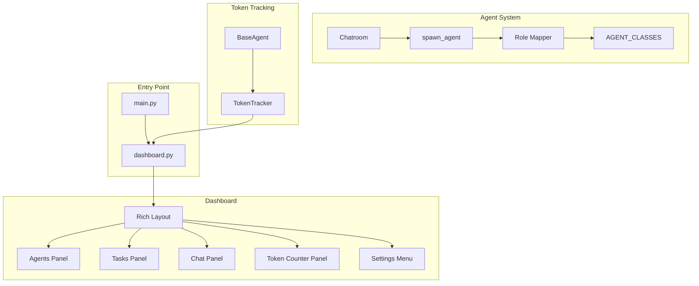

# Design Document: Swarm Fixes

## Overview

This design addresses three categories of fixes for the Multi-Agent Swarm application:
1. **Role Mapping**: Enable the Architect to spawn agents using display names (e.g., "Codey McBackend") in addition to role keys (e.g., "backend_dev")
2. **User Message Coloring**: Display user messages with a distinct lime green color for the username
3. **Dashboard Integration**: Make the dashboard the default entry point with token counting and comprehensive settings
4. **Token Counting**: Track and display API token usage in the dashboard
5. **Enhanced Settings Menu**: Provide comprehensive control over all swarm aspects

## Architecture



## Components and Interfaces

### 1. Role Mapper (agents/__init__.py)

Add a reverse mapping from display names to role keys:

```python
# Display name to role key mapping
DISPLAY_NAME_TO_ROLE = {
    "codey mcbackend": "backend_dev",
    "pixel mcfrontend": "frontend_dev",
    "bugsy mctester": "qa_engineer",
    "deployo mcops": "devops",
    "checky mcmanager": "project_manager",
    "docy mcwriter": "tech_writer",
    "bossy mcarchitect": "architect",
}

def resolve_role(name_or_role: str) -> str:
    """
    Resolve a display name or role key to a valid role key.
    
    Args:
        name_or_role: Either a role key (e.g., "backend_dev") or 
                      display name (e.g., "Codey McBackend")
    
    Returns:
        Valid role key
        
    Raises:
        ValueError: If name cannot be resolved
    """
    # Try as role key first
    if name_or_role.lower() in AGENT_CLASSES:
        return name_or_role.lower()
    
    # Try as display name
    normalized = name_or_role.lower().strip()
    if normalized in DISPLAY_NAME_TO_ROLE:
        return DISPLAY_NAME_TO_ROLE[normalized]
    
    # Not found
    valid_options = list(AGENT_CLASSES.keys()) + list(DISPLAY_NAME_TO_ROLE.keys())
    raise ValueError(f"Unknown role: {name_or_role}. Valid options: {valid_options}")
```

### 2. Token Tracker (core/token_tracker.py)

New module to track token usage across all agents:

```python
class TokenTracker:
    """Singleton to track token usage across all agents."""
    _instance = None
    
    def __new__(cls):
        if cls._instance is None:
            cls._instance = super().__new__(cls)
            cls._instance.prompt_tokens = 0
            cls._instance.completion_tokens = 0
            cls._instance.total_tokens = 0
            cls._instance.call_count = 0
        return cls._instance
    
    def add_usage(self, prompt: int, completion: int):
        """Record token usage from an API call."""
        self.prompt_tokens += prompt
        self.completion_tokens += completion
        self.total_tokens += prompt + completion
        self.call_count += 1
    
    def get_stats(self) -> dict:
        """Get current token statistics."""
        return {
            "prompt_tokens": self.prompt_tokens,
            "completion_tokens": self.completion_tokens,
            "total_tokens": self.total_tokens,
            "call_count": self.call_count
        }
    
    def reset(self):
        """Reset counters for new session."""
        self.prompt_tokens = 0
        self.completion_tokens = 0
        self.total_tokens = 0
        self.call_count = 0
```

### 3. Enhanced Dashboard (dashboard.py)

Update the dashboard to:
- Add token counter panel
- Add project selection at startup
- Enhance settings menu with all options
- Display user messages with lime green username

```python
# User style for messages
USER_STYLE = "bold bright_green"  # Lime green for user

def create_tokens_panel(self) -> Panel:
    """Create the token usage panel."""
    from core.token_tracker import get_token_tracker
    tracker = get_token_tracker()
    stats = tracker.get_stats()
    
    text = Text()
    text.append(f"Prompt: {stats['prompt_tokens']:,}\n", style="cyan")
    text.append(f"Completion: {stats['completion_tokens']:,}\n", style="yellow")
    text.append(f"Total: {stats['total_tokens']:,}\n", style="bold green")
    text.append(f"API Calls: {stats['call_count']}", style="dim")
    
    return Panel(text, title="📊 Tokens", border_style="cyan")
```

### 4. Main Entry Point (main.py)

Modify main.py to launch dashboard by default:

```python
def main():
    """Entry point - launches dashboard by default."""
    # Import and run dashboard
    from dashboard import DashboardUI
    dashboard = DashboardUI()
    asyncio.run(dashboard.run())
```

## Data Models

### TokenStats
```python
@dataclass
class TokenStats:
    prompt_tokens: int = 0
    completion_tokens: int = 0
    total_tokens: int = 0
    call_count: int = 0
```

## Correctness Properties

*A property is a characteristic or behavior that should hold true across all valid executions of a system-essentially, a formal statement about what the system should do. Properties serve as the bridge between human-readable specifications and machine-verifiable correctness guarantees.*

### Property 1: Role Resolution Consistency
*For any* valid display name in DISPLAY_NAME_TO_ROLE, calling resolve_role should return the corresponding role key that exists in AGENT_CLASSES.
**Validates: Requirements 1.1, 1.2**

### Property 2: Role Resolution Backwards Compatibility
*For any* valid role key in AGENT_CLASSES, calling resolve_role should return that same role key (case-insensitive).
**Validates: Requirements 1.2**

### Property 3: User Message Color Consistency
*For any* user message displayed in the chat, the username portion should be rendered with the lime green color code (ANSI or Rich style).
**Validates: Requirements 2.1, 3.4**

### Property 4: Token Counter Accumulation
*For any* sequence of API calls with known token counts, the TokenTracker total should equal the sum of all individual prompt and completion tokens.
**Validates: Requirements 4.2, 4.3**

### Property 5: Settings Persistence Round-Trip
*For any* setting changed via the settings menu, saving and reloading should preserve the exact value.
**Validates: Requirements 5.5**

### Property 6: Agent State Toggle
*For any* agent in the swarm, toggling its enabled state should flip the boolean value.
**Validates: Requirements 5.2**

## Error Handling

| Error Condition | Handling |
|----------------|----------|
| Unknown role name | Return error with list of valid options |
| Token tracking failure | Log error, continue without tracking |
| Settings save failure | Log error, notify user |
| Dashboard render failure | Fall back to basic mode |

## Testing Strategy

### Property-Based Testing

Use **Hypothesis** for Python property-based testing.

Each property-based test will:
1. Generate random valid inputs
2. Execute the operation
3. Verify the property holds
4. Run minimum 100 iterations

### Unit Tests

- Test role resolution with all valid display names
- Test role resolution with all valid role keys
- Test invalid role handling
- Test token tracker accumulation
- Test settings persistence

### Integration Tests

- Test dashboard startup flow
- Test project selection integration
- Test settings menu navigation
