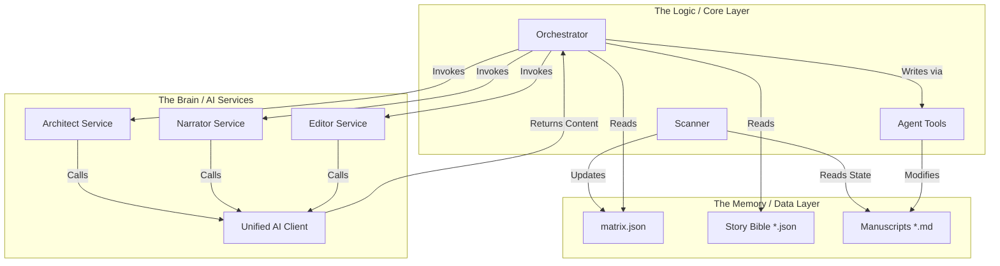

# TextCraft Master Architecture

**Version:** 2.1.0 (Refactored for Specialized Services)
**Status:** Approved
**System Type:** Data-Driven Creative Writing Engine

-----

## 1\. Architectural Overview: The Trinity

TextCraft uses a **Three-Pillar Architecture** that separates Intelligence, Logic, and Data. Unlike the previous iteration which used a generic agent wrapper, this version uses **Specialized AI Services** to handle specific narrative tasks. This ensures that Python code remains purely logical while creative direction is driven by data.

The system is composed of three isolated layers:

1.  **The Brain (AI Services):** Specialized modules (Architect, Narrator, Editor) that encapsulate prompt logic.
2.  **The Logic (Core):** The deterministic engine, loops, and tools.
3.  **The Memory (Data):** The persistent state of the story.

<!-- end list -->

-----

## 2\. The Three Pillars

### I. The Brain (`ai_services/`)

  * **Role:** The Intelligence Layer.
  * **Responsibility:** Contains the prompt engineering and API interaction logic for specific roles. It is stateless.
  * **Primary Components:**
      * `client.py`: The unified API Gateway. Handles authentication, rate limiting, and standardized response formatting.
      * `architect.py`: Logic for analyzing the Matrix and assigning tasks.
      * `narrator.py`: Logic for ingesting Character Sheets and generating prose.
      * `editor.py`: Logic for ingesting Story Bible rules and validating text.

### II. The Logic (`core/`)

  * **Role:** The Nervous System.
  * **Responsibility:** Manages the execution loop, file operations, and decision routing.
  * **Key Characteristic:** **Agnostic.** This code does not know *what* genre or story is being written. It simply executes instructions based on the data provided by Memory.
  * **Primary Components:**
      * `orchestrator.py`: The decision loop (Scan $\rightarrow$ Plan $\rightarrow$ Act).
      * `scanner.py`: The sensory input that maps the file system to JSON.
      * `agent_tools.py`: The physical manipulators (Read/Write/Edit).

### III. The Memory (`data/`)

  * **Role:** The Soul.
  * **Responsibility:** Holds the entire creative state of the project.
  * **Key Characteristic:** **Mutable.** This is the only layer that changes from project to project.
  * **Primary Components:**
      * `matrix.json`: The real-time dashboard of project health and progress.
      * `story_bible/`: Static configuration (Personas, Characters, Settings).
      * `manuscripts/`: The raw output (MarkDown files).

-----

## 3\. Global Directory Constants

The system relies on strict directory mapping to maintain separation of concerns.

| Constant | Path | Description | Access Level |
| :--- | :--- | :--- | :--- |
| `ROOT_DIR` | `./` | Project Root | Read-Only |
| `BRAIN_DIR` | `./ai_services/` | AI Logic | Read-Only |
| `CORE_DIR` | `./core/` | System Logic | Read-Only |
| `DATA_DIR` | `./data/` | **The Memory** | **Read/Write** |
| `MATRIX_PATH` | `./data/matrix.json` | Project State | Read/Write (Scanner/Orchestrator) |
| `BIBLE_DIR` | `./data/story_bible/` | Creative Config | Read-Only (Services) |
| `DRAFTS_DIR` | `./data/manuscripts/` | Story Output | Read/Write (Tools) |

-----

## 4\. The Orchestration Loop (Data Flow)

TextCraft operates on a continuous "Pulse" or loop, driven by `core/orchestrator.py`.

### Step 1: SCAN (The Senses)

  * **Actor:** `scanner.py`
  * **Input:** `data/manuscripts/*.md`
  * **Action:** Walks the directory, counts words, checks timestamps, and analyzes file markers (e.g., `TODO`).
  * **Output:** Updates `data/matrix.json`.

### Step 2: PLAN (The Architect)

  * **Actor:** `orchestrator.py` imports `ai_services.architect`.
  * **Call:** `architect.plan_next_step(matrix_data)`.
  * **Input:** `data/matrix.json` + `data/story_bible/personas.json`.
  * **Action:** The Architect Service constructs a prompt analyzing the state and sends it to the Brain.
  * **Output:** A JSON Decision Payload (e.g., `{"agent": "narrator", "task": "write_ch01", "context": "..."}`).

### Step 3: DISPATCH (The Assignment)

  * **Actor:** `orchestrator.py`
  * **Action:** Routes execution based on the `agent` key in the Decision Payload.
  * **Logic:**
      * If `agent == 'narrator'`: Calls `ai_services.narrator.execute(task, context)`.
      * If `agent == 'editor'`: Calls `ai_services.editor.execute(task, context)`.
  * **Action:** The specific Service inflates the prompt with data from `story_bible` (Characters, Tone) and calls the Client.

### Step 4: EXECUTE (The Action)

  * **Actor:** The AI Service (`narrator.py` or `editor.py`).
  * **Input:** The raw text response or function call from The Brain.
  * **Action:** The Service invokes `core.agent_tools` to modify `data/manuscripts/`.
  * **Output:** Physical changes to the hard drive.

-----

## 5\. Immutable Relationships (Rules of Engagement)

1.  **Unidirectional Dependency:**

      * **Logic** depends on **Memory** (for state) and **Brain** (for processing).
      * **Memory** never depends on Logic (Data is passive).
      * **Brain** never depends on Memory (AI is stateless).

2.  **The "Zero Creative Code" Rule:**

      * No character names, plot points, or prompt text shall exist in `.py` files.
      * All creative direction must be injected via `data/story_bible/*.json`.

3.  **The Matrix is Truth:**

      * Services do not "guess" the state of the project. They strictly read `matrix.json` (passed via Orchestrator).
      * If the Matrix is out of sync, the **Scanner** must run before any generation occurs.