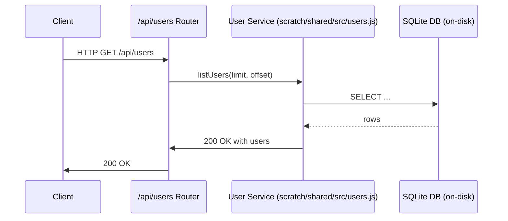

# User API Contract

Table of Contents
- [Overview](#overview)
- [API Surface](#api-surface)
- [Endpoints](#endpoints)
  - [GET /api/users](#get-apiusers)
  - [POST /api/users](#post-apiusers)
  - [GET /api/users/{id}](#get-apiusersid)
- [Request/Response Models](#requestresponse-models)
  - [CreateUserRequest](#createuserrequest)
  - [UserResponse](#userresponse)
- [Error Handling](#error-handling)
- [Validation Rules](#validation-rules)
- [Security Considerations](#security-considerations)
- [Environment & Config](#environment--config)
- [Usage Examples](#usage-examples)
- [Testing & Coverage](#testing--coverage)
- [Implementation References](#implementation-references)
- [OpenAPI Alignment](#openapi-alignment)
- [Changelog](#changelog)
- [Troubleshooting](#troubleshooting)
- [Diagrams](#diagrams)

---

## Overview
The User API provides on-disk SQLite-backed CRUD-like access to user records with on-server password hashing. The data store is configured via SCRATCH_DB_PATH. The default on-disk path is `scratch/shared/data/users.db`. All backend code uses CommonJS module syntax.

This document codifies the final contract for the User API and points to implementation references in `scratch/shared/src/users.js` and related router/module wiring.

See also:
- Implementation: `scratch/shared/src/users.js`
- API OpenAPI draft: `scratch/shared/docs/OpenAPI.md` (reference)
- Master delta/docs for module-system decisions: `scratch/shared/master_status_report.md` (reference)

---

## API Surface
- Base URL: /api
- Version: v1
- Security: Internal backend API with server-side validation; password information is never exposed.

---

## Endpoints
### GET /api/users
Retrieve a paginated list of users.

- Summary: List users
- Query Parameters:
  - limit: integer, optional, default 50, max 100
  - offset: integer, optional, default 0

- Responses:
  - 200 OK: {
      "users": [UserResponse],
      "count": number,
      "limit": number,
      "offset": number,
      "returned": number
    }
  - 400 Bad Request
  - 500 Internal Server Error

- Example
  - Request:
    ```bash
    curl -s -G http://localhost:3000/api/users --data-urlencode limit=10 --data-urlencode offset=0
    ```
  - Response:
    ```json
    {
      "users": [
        {
          "id": "u1",
          "username": "jdoe",
          "email": "jdoe@example.com",
          "fullName": "John Doe",
          "createdAt": "2025-04-01T12:00:00Z",
          "updatedAt": "2025-04-01T12:00:00Z"
        }
      ],
      "count": 1,
      "limit": 10,
      "offset": 0,
      "returned": 1
    }
    ```

### POST /api/users
Create a new user. Password will be hashed server-side before storage.

- Summary: Create a user
- Request Body: CreateUserRequest (application/json)
- Responses:
  - 201 Created: UserResponse
  - 400 Bad Request
  - 409 Conflict (user/email already exists)
  - 500 Internal Server Error

- Example
  - Request:
    ```bash
    curl -s -H "Content-Type: application/json" \
      -d '{"username":"jdoe","email":"jdoe@example.com","password":"Secur3P@ssw0rd","fullName":"John Doe"}' \
      http://localhost:3000/api/users
    ```
  - Response (201):
    ```json
    {
      "id": "u1",
      "username": "jdoe",
      "email": "jdoe@example.com",
      "fullName": "John Doe",
      "createdAt": "2025-04-01T12:00:00Z",
      "updatedAt": "2025-04-01T12:00:00Z"
    }
    ```

### GET /api/users/{id}
Fetch a single user by id.

- Path Parameter: id (string)
- Responses:
  - 200 OK: UserResponse
  - 404 Not Found
  - 400 Bad Request (invalid id)
  - 500 Internal Server Error

- Example
  - Request:
    ```bash
    curl -s http://localhost:3000/api/users/u1
    ```
  - Response:
    ```json
    {
      "id": "u1",
      "username": "jdoe",
      "email": "jdoe@example.com",
      "fullName": "John Doe",
      "createdAt": "2025-04-01T12:00:00Z",
      "updatedAt": "2025-04-01T12:00:00Z"
    }
    ```

---

## Request/Response Models
### CreateUserRequest
```json
{
  "username": "string (3-32 chars)",
  "email": "string (valid email)",
  "password": "string (min 8 chars)",
  "fullName": "string (optional)"
}
```

Validation rules:
- username: alphanumeric with allowed punctuation, 3-32 chars, unique
- email: valid email format, unique
- password: minimum 8 characters, must meet password strength requirements
- fullName: optional, max 100 characters

### UserResponse
```json
{
  "id": "string",
  "username": "string",
  "email": "string",
  "fullName": "string",
  "createdAt": "string (ISO 8601)",
  "updatedAt": "string (ISO 8601)"
}
```

Notes:
- Never expose password hashes in responses.
- Password is stored as a bcrypt hash on the server side.

---

## Error Handling
All errors use an ErrorResponse envelope when applicable.

```json
{
  "code": "INVALID_PAYLOAD",   // e.g., payload failed validation
  "message": "Password does not meet minimum length",
  "details": { /* optional field-level details */ }
}
```

Common error codes:
- INVALID_PAYLOAD: validation failures for request payload
- NOT_FOUND: requested resource not found (e.g., /api/users/{id})
- CONFLICT: duplicate username or email
- SERVER_ERROR: unexpected server-side error

---

## Validation Rules
- unique constraints on username and email
- email must be a valid email format
- required fields: username, email, password
- password minimum length and strength requirements are enforced server-side

---

## Security Considerations
- Passwords are never returned in any response.
- Passwords are hashed with bcrypt before storage.
- Access to the API is restricted to the backend and any orchestration layer; CORS and authentication strategies are managed at the edge (if applicable).

---

## Environment & Config
- SCRATCH_DB_PATH: Path to on-disk SQLite database used by the backend.
  - Default: scratch/shared/data/users.db
- Node.js environment uses CommonJS module system (no ESM imports in backend code).
- Ensure the running process has read/write permissions to the SCRATCH_DB_PATH directory.
- Example:
  ```bash
  SCRATCH_DB_PATH=/abs/path/scratch/shared/data/users.db npm start
  ```

---

## Usage Examples
- List users (limit 5):
  curl -s -G http://localhost:3000/api/users --data-urlencode limit=5
- Create a user: see POST example above
- Get a user by id: see GET /api/users/{id} example above

---

## Testing & Coverage
- Local tests assume SCRATCH_DB_PATH is set to an on-disk DB file.
- Run tests:
  ```bash
  npm install
  SCRATCH_DB_PATH=/path/to/scratch/shared/data/users.db npm test
  ```
- Tests cover:
  - CRUD-like operations for users (read and create path primarily)
  - Validation and error handling
  - Security invariants (password not exposed)

---

## Implementation References
- Backend router and endpoints: scratch/shared/infra/api/users.js
- Router wiring: scratch/shared/infra/api/index.js
- Core user logic: scratch/shared/src/users.js
- Tests: scratch/shared/tests/users.test.js

---

## OpenAPI Alignment
- This contract aligns with the OpenAPI draft currently maintained at scratch/shared/docs/OpenAPI.md. The OpenAPI spec should be synchronized with this README so that API consumers have a single source of truth.

---

## Changelog
- v1.0.0: Initial contract finalized for CommonJS backend; endpoints and models defined; environment variables documented.

---

## Troubleshooting
- If GET /api/users returns an empty list unexpectedly: verify the SCRATCH_DB_PATH points to the correct DB file and that the database contains seeded data or uses initialization bootstrap.
- If 500 errors occur: check backend logs for initialization errors, verify Node version compatibility with CommonJS modules, and ensure the on-disk SQLite DB is accessible.

---

## Diagrams
```

```

---
