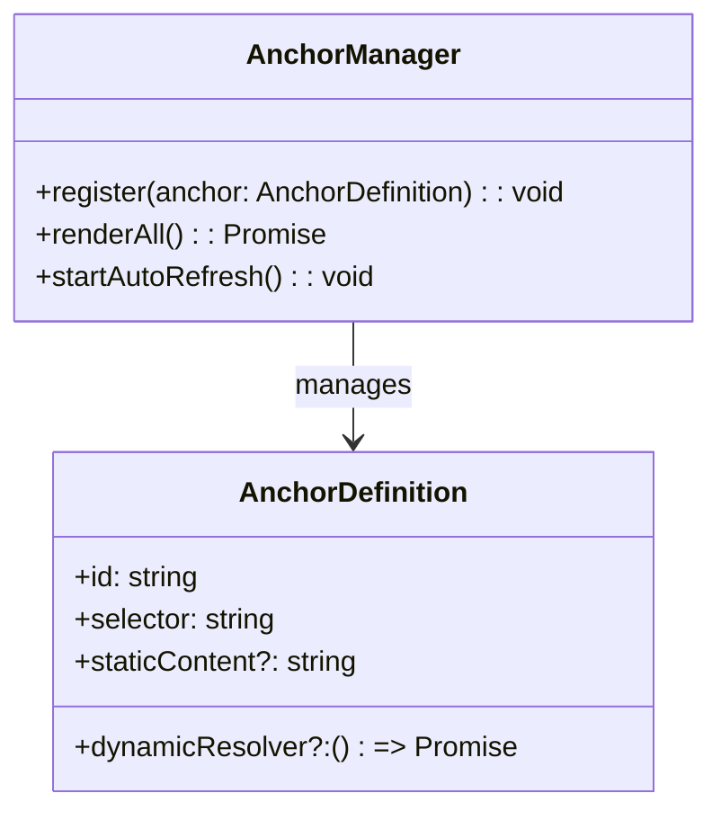

# Frontend Anchor Strategy (Detailed)

This document outlines the approach for anchoring static frontend templates to dynamic content, how anchors map to data sources, and the conventions used across the frontend codebase.

## Table of Contents
- Overview
- File Map
- Anchors to Dynamic Content Mapping
- Patterns & Conventions
- Usage Example
- Mermaid Architecture
- Troubleshooting
- References
- Directory Layout

## Directory Layout
- docs/frontend-anchor-strategy/README.md (this file)
- docs/frontend-anchor-strategy/FileMap.md
- docs/frontend-anchor-strategy/DynamicContent.md

## Overview
Anchors are stable points in the DOM (or templates) used to render content. They enable progressive hydration and partial updates.

## File Map
See FileMap.md for the authoritative mapping of anchors to sources.

## Anchors to Dynamic Content Mapping
Describe the dynamic flow, registration, rendering, and optional refreshing of content.

## Patterns & Conventions
- Data attributes: use data-anchor-id on elements
- Selectors: stable IDS or data attributes
- Content types: strings, HTML snippets, or component renderers
- Error handling: friendly fallback UI
- Internationalization: separate keys from strings

## Usage Example
```js
// src/frontend-anchors/anchorUsage.ts
import AnchorManager from '../src/frontend-anchors/anchorManager';

async function fetchWelcome(): Promise<string> {
  const res = await fetch('/api/anchors/welcome');
  if (!res.ok) return 'Welcome';
  const data = await res.json();
  return data.message ?? 'Welcome';
}

const manager = new AnchorManager(document.body);
manager.register({
  id: 'welcome-banner',
  selector: '#anchor-welcome',
  dynamicResolver: fetchWelcome,
  updateIntervalMs: 60000
});

manager.renderAll();
manager.startAutoRefresh();
```

## Mermaid Architecture


## Troubleshooting
- Verify selectors and data attributes
- Check fetch errors for dynamicResolver
- Ensure API permissions (CORS)

## References
- Internal guidelines for dynamic content loading
- Accessibility considerations for live regions
